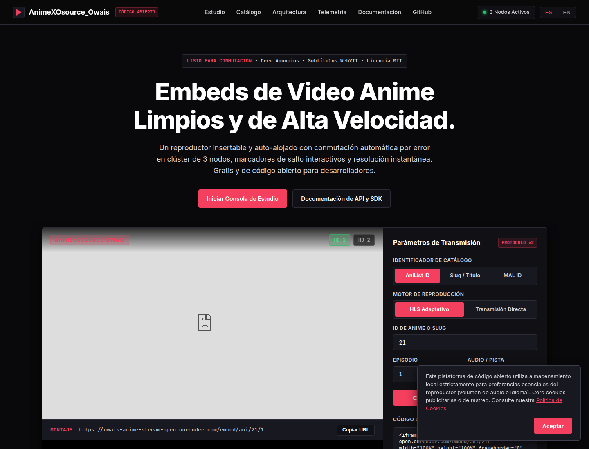

# AnimeXOsource_Owais

<p align="center">
  <strong>Open-source anime video embed infrastructure with a live public demo.</strong><br />
  <sub>FastAPI · HLS.js · AniList · AniSkip · WebSockets · Docker · Render</sub>
</p>

<p align="center">
  <a href="https://owais-anime-stream-open.onrender.com/"></a>
  <a href="https://owais-anime-stream-open.onrender.com/docs"></a>
  <a href="https://github.com/greenman9909-cmd/owais-anime-stream/blob/main/LICENSE"></a>
  <a href="https://ko-fi.com/yorusayano"></a>
</p>

AnimeXOsource_Owais is an open-source FastAPI platform for catalog discovery, browser-based video embeds, stream-provider integration, subtitle metadata, AniSkip markers, HMAC-signed URLs, and cluster telemetry. The repository is designed to be self-hosted and provider-configurable rather than tied to one deployment.

> **Live testing:** Open the [public studio](https://owais-anime-stream-open.onrender.com/) and test the catalog, Studio Console, telemetry, documentation, and embed generator directly. The hosted free-tier service may need a few seconds to wake up after inactivity.

## Preview



*The live Studio Console provides catalog ID selection, player configuration, embed-code generation, and cluster telemetry in one place.*


*Bundled poster artwork used by the open-source catalog and local fallback views.*

The public embed player is also available at [`/embed/ani/21/1?track=sub`](https://owais-anime-stream-open.onrender.com/embed/ani/21/1?track=sub). Provider playback depends on the configured, authorized resolver and on the upstream provider accepting the browser request.

## What the project includes

- **Studio Console:** Test anime IDs, slugs, episode numbers, audio tracks, and player modes, then copy an iframe URL.
- **Live catalog:** Search AniList GraphQL metadata and inspect title, artwork, year, format, score, and episode information.
- **Embed player:** Use direct iframe routes for AniList IDs, MyAnimeList IDs, or slugs.
- **Provider fallback:** Return browser-mountable `dataLink` embed sources when a provider blocks server-side token extraction.
- **Playback metadata:** Return source priority, embed URLs, subtitles, signed URLs, and AniSkip intro/outro markers.
- **Telemetry:** Probe configured edge hosts and expose service health through `/api/health`.
- **Developer surface:** Swagger UI, OpenAPI JSON, iframe examples, postMessage events, and a deployment blueprint.
- **Container deployment:** Run the same Python 3.11 and Node.js bridge in Docker locally or on Render.

## System architecture

```text
Browser / host website
        │
        ├── Studio Console
        ├── iframe embed routes
        └── REST + postMessage integration
                    │
                    ▼
        FastAPI application (port 8000)
        ├── AniList catalog client
        ├── stream resolver and browser fallback
        ├── AniSkip marker client
        ├── HMAC origin shield
        └── cluster telemetry
                    │
                    ├── Node.js decryption bridge
                    └── configured authorized resolver/provider
```

## Try the live API

The deployed service is `https://owais-anime-stream-open.onrender.com`.

```bash
# Service health and edge telemetry
curl https://owais-anime-stream-open.onrender.com/api/health

# Live catalog search
curl 'https://owais-anime-stream-open.onrender.com/api/search?q=one%20piece&perPage=6'

# Stream metadata and browser-mountable provider sources
curl 'https://owais-anime-stream-open.onrender.com/api/stream/21/1?lang=sub'

# Generate an iframe snippet
curl 'https://owais-anime-stream-open.onrender.com/api/embed-code?slug=ani/21&ep=1'
```

The live service exposes interactive documentation at [`/docs`](https://owais-anime-stream-open.onrender.com/docs) and its machine-readable contract at [`/openapi.json`](https://owais-anime-stream-open.onrender.com/openapi.json).

## Embed it in another website

```html
<iframe
  src="https://owais-anime-stream-open.onrender.com/embed/ani/21/1?track=sub"
  width="100%"
  height="600"
  frameborder="0"
  allow="autoplay; fullscreen; picture-in-picture"
  allowfullscreen
  title="AnimeXOsource_Owais player">
</iframe>
```

Supported route formats are:

```text
/embed/ani/{anilist_id}/{episode}
/embed/mal/{mal_id}/{episode}
/embed/{slug}/{episode}
```

See the complete examples in [`docs/EMBEDDING.md`](docs/EMBEDDING.md) and the implementation notes in [`docs/IMPLEMENTATION_GUIDE.md`](docs/IMPLEMENTATION_GUIDE.md).

## Listen for player events

The player communicates with its parent page through `window.postMessage` using the `yoru:event` protocol.

```javascript
window.addEventListener('message', (event) => {
  if (event.data?.source !== 'AnimeXOsource_Owais') return;

  const { event: name, currentTime, duration, server } = event.data;
  if (name === 'ready') console.log('Player ready on', server);
  if (name === 'timeupdate') console.log(currentTime, duration);
  if (name === 'failover') console.log('Provider failover requested');
});
```

## 📱 Android anime app

The Android client under `android/` now runs its **own backend on the phone**.

When the APK opens it starts a loopback HTTP service such as:

```text
http://127.0.0.1:8765
```

The bundled APK-specific UI is served from that local service. The Android app does not use the Render deployment as its API.

On-device features include:

- Localhost backend started automatically on launch
- AniList search, trending, top-rated and detail requests made from the device
- Local metadata caching
- My List and Continue Watching stored on the phone
- SUB / DUB local source templates
- Local video or embed playback modes for sources the user is authorized to use
- Official streaming links surfaced from AniList when available

The APK deliberately does not bundle third-party token-decryption or access-control bypass logic. See [`android/README.md`](android/README.md) for the local source adapter format.

GitHub Actions publishes the latest successful Android build to the repo root as `OWAIS-Anime.apk`.

## Run locally

Requirements are Python 3.11+, Node.js, npm, and optionally Docker.

```bash
git clone https://github.com/greenman9909-cmd/owais-anime-stream.git
cd owais-anime-stream
python -m venv .venv
source .venv/bin/activate
pip install -r requirements.txt
npm install --prefix node
cp .env.example .env
python -m pytest -v
python -m uvicorn reanime.app:app --host 127.0.0.1 --port 8000
```

Open [`http://127.0.0.1:8000`](http://127.0.0.1:8000) for the studio and [`http://127.0.0.1:8000/docs`](http://127.0.0.1:8000/docs) for Swagger UI.

### Run with Docker

```bash
docker build -t animexo-player .
docker run --rm -p 8000:8000 --env-file .env animexo-player
```

## Render deployment

The repository includes [`render.yaml`](render.yaml) and [`Dockerfile`](Dockerfile). The current public service is deployed from `main` as a Docker web service on Render with automatic deploys enabled.

For a new deployment:

1. Open [Render Dashboard](https://dashboard.render.com/).
2. Choose **New + → Blueprint**.
3. Select this repository and the `main` branch.
4. Keep the Docker runtime and `/api/health` health check.
5. Set a unique `SHIELD_SECRET` and add an authorized `RESOLVER_BASE` and optional `RESOLVER_KEY` when a provider resolver is available.
6. Deploy, then test `/`, `/api/health`, `/docs`, and an `/embed/...` route.

The step-by-step deployment reference is in [`docs/DEPLOYMENT.md`](docs/DEPLOYMENT.md).

## Environment variables

| Variable | Required | Purpose |
| --- | --- | --- |
| `PORT` | No | HTTP port; Render supplies this automatically. The Docker default is `8000`. |
| `SHIELD_SECRET` | Recommended | Random secret used for HMAC URL signing. |
| `RESOLVER_BASE` | No | Authorized external resolver base URL. Leave blank to use the built-in bridge. |
| `RESOLVER_KEY` | No | Bearer key for a private resolver service. |
| `STUDIO_TOKEN` | No | Optional bearer token for protected studio access. |
| `SORA_HOST` | No | Optional US-East telemetry host. |
| `NEKO_HOST` | No | Optional EU-West telemetry host. |
| `ZOZO_HOST` | No | Optional AP-South telemetry host. |

Do not commit `.env`, provider cookies, access tokens, or private resolver credentials.

## Repository map

```text
Dockerfile                  Production Python + Node container
render.yaml                 Render Blueprint
reanime/app.py              FastAPI routes and application setup
reanime/resolver.py         Provider resolution and direct-embed fallback
reanime/static/embed.js     Browser player and provider-frame mounting
reanime/templates/          Studio and embed HTML templates
reanime/anilist.py          AniList metadata client
reanime/aniskip.py          AniSkip marker client
reanime/shield.py           HMAC URL signing and validation
node/                       Node.js decryption bridge
frontend-integration/       Small client integration examples
android/                    Local-first Android streaming client
docs/                       API, embedding, deployment, and implementation docs
tests/                      Resolver, shield, and API tests
```

## Open-source boundaries

This project is released for self-hosting, experimentation, and authorized integrations. You are responsible for the media sources, provider permissions, copyright compliance, privacy notices, and local legal requirements that apply to your deployment. The repository does not include private provider credentials or claim ownership of third-party media.

## Contributing

Issues and pull requests are welcome. Please keep provider integrations configurable, add tests for behavior changes, update the relevant documentation, and never commit credentials, cookies, scraped private data, or generated local databases. Read [`CONTRIBUTING.md`](CONTRIBUTING.md) before opening a pull request.

## Support the project

If AnimeXOsource_Owais helps you build or learn, optional support is available through [Ko-fi](https://ko-fi.com/yorusayano). The project remains open source under the MIT License whether or not you contribute financially.

<p align="center">
  <a href="https://ko-fi.com/yorusayano"></a>
</p>

## License

Released under the [MIT License](LICENSE). Copyright (c) 2026 AnimeXOsource_Owais contributors.
